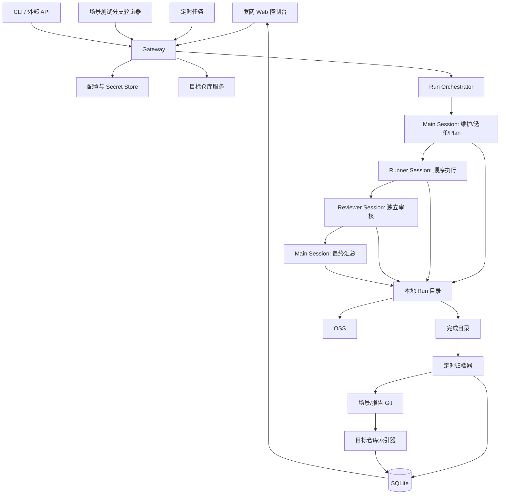

# 罗网（LuoWang）场景测试 Harness MVP 规格

- 工件类型：Spec
- 关联 Intent：[intent.md](./intent.md)
- 关联 Plan：[plan.md](./plan.md)
- 状态：MVP Implementation Baseline v0.7
- 日期：2026-08-29
- 中文名：罗网
- 英文名：LuoWang
- GitHub 目标：公开仓库 `cynos-ai/luowang`
- 许可证：`PolyForm-Noncommercial-1.0.0`（公开源码、限制商业用途，不属于 OSI Open Source）
- 本地目录：`/home/sj/Codes/cynos/luowang`
- 项目定位：AI Scenario Testing Harness
- MVP 部署范围：单租户、单目标仓库、每个部署一个测试环境

## 1. 核心目标

罗网是一个可独立部署的场景化测试 Harness。它不属于 Cynos Engineer，也不依附任何写代码、生成需求或修复 Bug 的 Agent。

它只负责：

1. 基于项目代码、`docs/PROJECT.md` 和需求文档建立、维护场景测试集；
2. 在新提交或人工请求到来时，判断需要测试哪些场景；
3. 为本次测试生成实际测试 plan；
4. 按 plan 执行测试；
5. 记录关键执行内容和证据；
6. 生成 Runner 的未审核报告；
7. 由独立 Reviewer 审核；
8. 汇总最终报告；
9. 将长期场景和 Markdown 报告写入目标项目 Git；
10. 将详细运行记录归档到本地数据库；
11. 通过长期运行的网站展示 Harness 状态、配置、场景资产、运行记录和报告；
12. 对已经确认的不同 Bug 创建或关联一个或多个 GitHub Issue，包括整体结果为 blocked 时已经确认的 Bug；但不继续生成修复需求或调度开发 Agent。

## 2. 已确认的设计偏好

本设计明确遵守以下项目负责人偏好：

- 先依赖 skills、提示词和裸 Pi 能力，不提前构建复杂约束框架；
- 不引入 concern；
- 不引入多阶段 checkpoint；
- 不引入自定义 ToolResult 体系；
- 不引入复杂 workflow gate；
- 最多保留一个简单的运行结束检查；
- 场景状态只有 `draft`、`approved`、`deprecated`；
- 删除场景通过 `deprecated` 表达，不物理删除；
- 不维护测试套件文件，场景自身标签只用于检索和加权；
- AI 根据需求、代码 diff、场景名称、描述、标签和全文做最终选择；
- `core` 可以通过项目配置要求每次都执行；
- MVP 不做并发；以后通过容器级 worker 实现环境隔离和并行，不把并发属性写入场景；
- 运行过程中先写本地文件，不持续写运行数据库；
- 运行完成后由独立定时归档任务写数据库和 Git；
- Git 是长期测试资产和正式报告的事实源；数据库是网站读模型、本地缓存和备份；
- 网站是 Harness 的控制台，不是某次测试生成的 HTML 报告；
- 报告保持 Markdown；
- 环境和 Secrets 通过网站配置，不写目标项目文件；
- MVP 每个罗网部署只管理一个目标仓库，并为该仓库配置一个测试环境；
- 只配置并跟踪一个长期场景测试分支，默认名为 `scenario-testing`；所有自动测试都在这条分支上向前推进；
- MVP 不做多仓库和多租户；验证完成后再决定演进为单平台多仓库，还是保持单仓库独立部署；
- 截图、trace 等资源直接写 OSS，报告记录资源地址，不建立复杂 artifact 实体；
- MVP 使用 SQLite；
- Harness 不通知或调用开发 Agent，后续修复由人类或另一个系统负责。

## 3. MVP 范围与非目标

### 3.1 MVP 包含

- 单实例 Gateway；
- 单管理员密码登录；
- 一个目标仓库和一条场景测试分支的配置与同步；
- 该仓库的一个测试环境；
- Harness 级 Provider；
- Main、Runner、Reviewer 三类 Agent 配置；
- Git 定时轮询、定时测试、网站人工触发；
- 场景初次整理与后续维护；
- 基于标签和语义的场景选择；
- 顺序执行；
- 独立审核；
- Markdown 报告；
- SQLite；
- OSS；
- 网站展示和配置；
- Docker 部署；
- MCP 浏览器能力。

### 3.2 MVP 不包含

- 多用户和角色权限；
- 多租户；
- 一个部署管理多个目标仓库；
- 同时跟踪或推断多条开发分支的测试进度；
- 测试执行并发；
- 容器 worker 池；
- 多环境选择；
- 发布 gate；
- 与开发 Agent 的通信；
- 自动生成 Bug 修复需求；
- 自动修产品代码；
- 通用工作流引擎；
- 复杂场景状态机；
- 全量 Agent 对话和原始工具结果的结构化建模；
- ReportPortal、Testkube 等重型外部平台。

## 4. 目标项目文件约定

罗网默认读取和维护当前唯一目标仓库的场景测试分支中的以下项目文件：

```text
docs/
├── PROJECT.md
├── changes/
│   └── <change-id>/
│       ├── intent.md
│       ├── spec.md
│       └── plan.md
└── scenario-testing/
    ├── scenarios/
    │   ├── <SCENARIO-ID>.md
    │   └── ...
    └── reports/
        └── <run-id>/
            ├── draft-report.md
            ├── review.md
            └── report.md
```

罗网不要求目标项目创建 `AGENTS.md`、目录 README、`architecture.md`、`conventions.md`、`testing.md`、`release.md` 或需求 `outcome.md`。

需求目录不包含场景测试提案。需求 Agent 只负责 `intent.md`、`spec.md` 和 `plan.md`，不需要了解场景、标签、选择策略或 Runner。罗网在测试时独立结合这些需求文件、累计 diff、代码和现有场景完成影响分析。

### 4.1 场景格式

```markdown
---
id: AUTH-LOGIN-001
name: 登录状态恢复
description: 验证用户登录后刷新受保护页面时仍保持登录状态
status: approved
tags:
  - core
  - module:认证
  - flow:登录
---

## 目的
……

## 前置条件
……

## 步骤
……

## 期望
……

## 需要记录
……
```

固定字段只有：

- `id`；
- `name`；
- `description`；
- `status`；
- `tags`。

字段名固定使用英文。字段值和正文使用网站配置的生成语言。

MVP 仅赋予少量标签特殊语义：

- `core`：高权重核心场景；
- `module:<name>`：模块检索；
- `flow:<name>`：业务流程检索；
- `external`：外部服务或外部副作用。

没有 `suites.yaml`，没有 domain 目录，没有单独 journey 目录。

### 4.2 场景维护权限

当前目标仓库配置一个模式：

| 模式 | 行为 |
|---|---|
| `autonomous` | AI 可以新增、修改、标记 deprecated，并执行 |
| `add-only` | AI 可以新增并执行；修改和 deprecated 需要人工确认 |
| `review-all` | 所有长期场景变更都需要人工确认 |

不需要人工确认时：

1. Main 只在当前工作树产生 `scenario-changes.patch`，不直接写远程 Git；
2. Runner 在当前 Run 中执行变更后的场景，Reviewer 审核执行结论和场景变更；
3. 当前 Run 不因为场景维护本身 blocked，仍按实际测试结果形成 `passed | failed | blocked`；
4. Archiver 将 patch 直接提交到场景测试分支，不创建 PR。

需要人工确认时：

1. 罗网完成拟议改动并生成本地 `scenario-changes.patch`；
2. 当前 Run 写明覆盖缺口，以 `blocked` 结束且不推进，不等待人类；
3. 独立归档任务稍后将 patch 推送为以场景测试分支为目标的 PR；
4. PR 记录来源 Run ID、当时的 `target_commit`、变更理由和未完成的覆盖，Run Store 记录 `scenario_pr_url`；
5. 人类可以修改、合并或关闭 PR；PR 合并后可以人工重测，或等待下一次产品/需求变化触发测试，旧 Run 保持 blocked。

场景 PR 本身就是测试资产变更的审核和跟踪对象，MVP 默认不为同一件场景维护工作重复创建 Issue。若 blocked Run 已经确认产品 Bug，仍按 Bug 分别创建或关联 Issues；场景 PR 可以写 `Related to #...`，但不能因测试资产合并而关闭产品 Bug。

运行中的 Main 不直接写远程 Git。`autonomous` 模式和 `add-only` 中允许直接新增的 patch 都由独立归档任务提交；需要 PR 时，PR 目标同样是场景测试分支。`add-only` 的同一 patch 若混合新增与修改或 deprecated，整份 patch 进入 PR，不拆分发布。

Pi RPC 确实支持阻塞式 `select/confirm/input/editor`，但这种等待只存在于当前进程内，不适合跨小时或跨天审批，因此不作为 MVP 的持久化人机流程。

### 4.3 陌生项目的场景测试集初始化

#### 4.3.1 目标

初始化不是让 AI 一次生成“完整测试大全”，而是为一个此前没有罗网场景资产的项目建立**最小可信基线**：

- 覆盖主要用户、入口和核心业务能力；
- 每个长期场景都有可追溯的需求、代码或运行时依据；
- 优先建立少量高价值场景，避免按页面、接口或控件机械铺量；
- 能执行的场景经过一次真实执行；
- 无法确认的内容保留为 `draft` 或覆盖缺口，不猜测期望；
- 后续再随需求和缺陷持续扩充，不宣称初始化后已经穷尽全部行为。

初始化是同一种 Run 的特殊请求，不增加新的场景状态、suite 文件、catalog 文件或长期状态机。

#### 4.3.2 前置条件

开始前检查：

- 目标仓库和场景测试分支已经同步到明确 commit；
- 网站已配置该仓库的测试环境和允许使用的测试账号；
- 测试环境可访问，且确认不是生产环境；
- 仓库中的安装、启动和现有测试命令可识别；
- Web 项目可以建立浏览器会话；API 项目优先找到 OpenAPI/GraphQL schema；
- 涉及外部副作用的目标已经在环境说明中明确允许。

若运行环境、认证或必要依赖不可用，仍可完成静态分析，但只能提交 `draft` 场景和阻塞说明，不能把未执行推测标为已验证基线。

#### 4.3.3 证据优先级

Main 按以下优先级建立行为理解：

1. 明确规格：`docs/PROJECT.md`、`docs/changes/**`、PRD、OpenAPI/GraphQL schema、用户文档；
2. 已有可执行证据：现有端到端/集成测试、fixtures、seed、示例和测试数据；
3. 运行时观察：页面、API 响应、权限差异、状态变化、持久化和错误行为；
4. 代码证据：路由、控制器、领域状态、校验、权限、外部集成和数据库结构；
5. AI 推断：只用于提出待验证候选，不能单独确定业务期望。

若资料、代码和运行行为冲突，场景保持 `draft`，并在初始化报告中记录冲突。证据理由写入本次 plan/report 或 PR 描述，不增加场景 frontmatter 字段。

`docs/PROJECT.md` 缺失时，Main 可以在 `plan.md` 中形成临时项目理解继续工作，但罗网不代替项目理解流程创建或维护该文件。

#### 4.3.4 顺序初始化流程

初始化使用现有 Main、Runner、Reviewer 三种角色，但允许同一角色创建多个短 session：

```text
Main 静态勘察
  → Runner 运行时侦察
  → Main 候选场景综合
  → Runner 候选验证（策略允许时）
  → Reviewer 独立审核
  → Main 最终修订与报告
```

具体步骤：

1. **Preflight**：验证仓库、环境、认证、基础命令和浏览器/API 可达性；
2. **静态勘察**：读取项目文档、需求、现有测试、应用入口、路由、schema、权限、状态和外部依赖；
3. **运行时侦察**：Runner 从已知入口登录，以低风险方式遍历主要导航和状态转换，记录实际可见能力；
4. **临时能力图**：Main 在本次 `plan.md` 中整理“用户/入口 → 能力 → 关键状态 → 风险 → 证据”，不新建长期 catalog；
5. **候选生成**：把业务结果相近的步骤合成场景，去重后生成 `scenario-changes.patch`；
6. **策略处理**：若场景模式要求人工审核，生成 PR 所需 patch 和覆盖缺口后结束；合并后可人工重测，或等待下一次产品/需求变化触发；
7. **候选验证**：策略允许直接新增时，Runner 顺序执行候选场景，创建并清理临时数据；
8. **独立审核**：Reviewer 检查期望是否有依据、证据是否支持结论、是否遗漏明显核心流程；
9. **最终修订**：初始化 run 中的最终 Main 可以依据 Reviewer 修订场景 patch、状态和最终报告；
10. **发布**：Archiver 按既有策略提交场景或创建 PR，Repository Indexer 再从 Git 重建网站缓存。

所有勘察和验证都在测试/预发布环境进行。默认禁止删除全局数据、批量发信、真实支付、生产发布等不可逆行为。

#### 4.3.5 候选场景生成规则

Main 至少检查以下类别，但只在项目确实存在对应行为时生成场景：

- 主要用户角色的核心成功路径；
- 登录、退出、会话恢复和权限隔离；
- 关键业务实体的创建、状态转换、持久化和查询；
- 关键校验、拒绝路径和错误恢复；
- 跨页面、跨模块或跨 API 的完整用户结果；
- 外部依赖失败或不可用时的用户可见行为；
- 可能造成数据损失、安全问题、资金影响或大范围不可用的行为；
- 项目现有测试、历史缺陷或需求明确强调的回归行为。

不采用以下机械转换：

- 每个页面生成一个场景；
- 每个 API operation 生成一个长期业务场景；
- 每个按钮、字段或分支生成一个场景；
- 把现有单元测试逐条翻译成场景；
- 把随机 crawler 到达的每个状态都写入 Git。

`core` 只用于主要用户无法完成核心目标、可能造成严重数据/权限/资金后果，或每次变更都值得验证的场景。

场景是否 `approved` 与本次产品是否通过是两件事：有明确依据的场景即使首次执行发现产品 Bug，仍可成为 `approved`；期望本身不确定时才保持 `draft`。

#### 4.3.6 停止条件

满足以下条件即可结束首轮初始化：

- 每个主要用户角色和主要产品入口已被检查；
- 每项已识别的核心业务能力至少有一个成功路径，必要的权限/校验/持久化风险已有覆盖或明确缺口；
- 所有准备设为 `approved` 的场景都有明确证据依据；
- 策略允许时，所有新增 `approved` 场景至少真实执行一次；
- 最后一次高层导航/schema/现有测试复查没有发现新的高价值核心能力；
- 未覆盖项、环境阻塞和资料冲突已经写入报告。

停止条件是风险覆盖，不是场景数量、页面数量或代码覆盖率百分比。

#### 4.3.7 可借鉴的开源方案

| 方案 | 值得借鉴 | 罗网的取舍 |
|---|---|---|
| [Playwright Test Agents](https://playwright.dev/docs/test-agents) | 官方 `planner → generator → healer`；Planner 使用 seed/PRD 探索应用并输出 Markdown plan | 最直接的参考。罗网采用“先探索、产出可读 plan、再验证”的流程，但长期资产仍是罗网场景 Markdown，不生成和维护一套 Playwright spec.ts |
| [Crawljax](https://github.com/crawljax/crawljax) | 对现代 Web 应用做事件驱动探索，产生 DOM state-flow graph | 借鉴临时状态/转换图和去重思路；不引入 Java 依赖，不把图作为长期资产 |
| [TESTAR](https://testar.org/about/) | 循环执行“扫描状态 → 推导动作 → 执行动作 → oracle”，并按时间/动作预算停止 | 借鉴低风险侦察和明确停止条件；随机或 scriptless robustness 结果不能直接成为业务期望 |
| [GraphWalker](https://github.com/GraphWalker/graphwalker-project) | 用有向图表达状态与转换并生成遍历路径 | 只借鉴能力/状态覆盖思路；MVP 不增加 model 文件或 model-based runner |
| [Schemathesis](https://schemathesis.io/) | 从 OpenAPI/GraphQL 自动产生 property-based、schema-aware 和 stateful API 测试 | API 项目可作为可选侦察工具；发现结果用于提炼少量业务场景，不把大量 fuzz case 导入场景集 |
| [RESTler](https://github.com/microsoft/restler-fuzzer) | 从 OpenAPI 推断请求的 producer-consumer 依赖，探索深层 API 状态 | 借鉴 API 操作依赖推断；MVP 不默认集成其 .NET/重 fuzz 流程，避免对共享测试环境造成资源风险 |
| [EvoMaster](https://github.com/WebFuzzing/evomaster) | 黑盒/白盒生成系统级 API 测试，并通过搜索和执行反馈提高覆盖 | 借鉴“生成 → 执行 → 反馈 → 缩小有效测试集”；依赖和运行成本较高，不作为 MVP 默认组件 |
| [Keploy](https://github.com/keploy/keploy) | 从真实 API/数据库/消息流量 record/replay，发现实际用户路径和依赖 | 有合法、脱敏的测试流量时可作为补充证据；eBPF、流量隐私和基础设施要求使其不适合作为默认初始化方式 |
| [Qodo Cover](https://github.com/qodo-ai/qodo-cover) | 收集上下文、生成测试、执行、读取覆盖反馈并迭代 | 只借鉴闭环思想；它主要面向单元测试且仓库已声明停止维护，不作为依赖 |
| [Hercules](https://github.com/test-zeus-ai/testzeus-hercules) | Gherkin 输入、多 Agent 执行、UI/API/视觉证据 | 适合参考已有场景的执行与证据组织，不解决陌生项目的可信场景发现 |
| [Midscene.js](https://github.com/web-infra-dev/midscene) | 纯视觉 UI 定位、自然语言动作与视觉断言 | 可补足 Canvas、无语义控件和视觉断言；MVP 已有 Playwright MCP + 视觉 Reviewer，不再叠加默认执行框架 |

结论：目前没有一个成熟开源项目能从任意陌生仓库直接生成可信、业务级、可长期维护的场景测试集。最可行的是组合 Playwright Planner 的探索流程、Crawljax/TESTAR 的状态探索原则、API schema 工具和罗网自己的代码/需求理解，再由真实执行与独立 Reviewer 收口。

## 5. 测试选择

罗网不定义 `full/core/change-regression/bug-regression/explicit/exploratory` 枚举。

测试请求可以是自然语言，也可以是定时任务预设文本。例如：

- “对最新提交选择必要的场景测试”；
- “跑全部 approved 场景”；
- “跑所有核心场景”；
- “验证这个 Bug”；
- “执行 AUTH-LOGIN-001”。

选择流程：

1. 读取测试请求；
2. 读取本次 `base_commit`、`target_commit`、中间 commit 列表和累计 diff；
3. 读取关联的 `docs/changes/<change-id>/`；
4. 读取 `docs/PROJECT.md`；
5. 读取与本批 commit、需求或历史失败相关的 GitHub Issues 和既有 Run；
6. 通过 `tags + name + description` 检索候选；
7. 按需读取候选场景全文；
8. AI 综合判断需求、修复、历史 Issue 与场景之间的关系，选择最终范围并在 plan 中写明理由。

项目配置可以指定：

```yaml
alwaysIncludeTags:
  - core
```

这表示每次测试都必须包括所有 `approved + core` 场景。它是组织策略，不是测试套件。

若当前行为没有长期场景覆盖：

- `autonomous` 或允许新增时，AI 可以在本地工作树创建场景并执行；
- 需要人工审核时，本次生成场景 patch、记录覆盖缺口并以 `blocked` 结束，归档任务随后创建关联当前 Run 的 PR；
- 不用不相关场景冒充覆盖。

最终选择可以为零个场景，但必须区分两种情况：

- Main 明确判断本批变化不影响需要场景验证的产品行为，并由 Reviewer 独立确认：`scenario_results` 可以为空，最终结果为 `passed`；报告写明判断依据，发布成功后正常推进；
- 因场景缺失、影响不明、证据不足或环境限制而无法选择可信场景：不能以“零场景”通过，应新增场景、生成场景 PR，或以 `blocked` 结束。

不为“无需场景测试”增加新的结果状态。

## 6. 总体架构



## 7. Gateway

借鉴 OpenClaw Gateway 的核心思想：一个长期运行的进程拥有所有控制入口、任务生命周期和对外查询。

罗网 Gateway 负责：

- 提供网站和 API；
- 管理认证；
- 保存配置；
- 管理当前唯一目标仓库和场景测试分支；
- 只轮询该场景测试分支；
- 运行 Cron；
- 接收人工测试请求；
- 创建和调度 Run；
- 调用 Pi SDK；
- 暴露当前 Harness 状态；
- 执行归档和仓库索引后台任务。

MVP 不复制 OpenClaw 的完整 WebSocket 协议、设备配对、角色、scope 和 node 模型。

初期使用普通 HTTP API 和网站轮询即可。以后需要实时流式状态时再增加 SSE 或 WebSocket，但内部统一通过 `submitTestRequest` 入口创建任务。

## 8. 本地 Run 目录

运行目录只保存本次测试真实产生的内容，不复制 Harness 配置、全局状态或仓库状态。

```text
<data>/report/
├── running/
│   └── <run-id>/
│       ├── plan.md
│       ├── execution.md
│       ├── draft-report.md
│       ├── review.md
│       ├── report.md
│       ├── scenario-changes.patch # 可选：本次产生长期场景变更时存在
│       └── evidence/              # 可选：上传 OSS 前的临时文件
└── completed/
    └── <run-id>/
        └── 同上
```

各文件职责：

- `plan.md`：本次选择、理由、执行顺序和预期证据；
- `execution.md`：关键执行过程、观察、失败、清理和 OSS 链接；
- `draft-report.md`：Runner 的未审核报告；
- `review.md`：Reviewer 的独立审核；
- `report.md`：最终报告；
- `scenario-changes.patch`：本次 Main 产生的长期场景变更，只有发生变更时存在；
- `evidence/`：浏览器或命令先产生本地文件时的临时目录，上传后可以删除。

五个 Markdown 文件不建立额外 frontmatter 或结构化结果协议：

- 只有最终 `report.md` 的 §22.4 frontmatter 是 Archiver 和网站必须解析的机器契约；
- `plan.md`、`execution.md`、`draft-report.md`、`review.md` 按上述职责保存面向人类和后续 Agent 的 Markdown，生成语言由仓库配置决定；
- `finalizeRun` 对这四个文件只检查存在、非空和本次角色流程确实已完成，不依赖固定中文/英文标题解析语义；
- 内容是否支持结论由 Reviewer 和 Main B 负责，自动化测试使用固定样例验证各角色确实写入其职责要求的信息，不增加自定义 ToolResult 或重复状态文件。

不保存：

- `request.json`；
- `status.json`；
- `config-snapshot.json`；
- 私有 environment 文件；
- Harness 全局配置；
- 自定义 ToolResult 文件；
- 多份状态机文件。

Harness 当前状态属于 Gateway，不属于 Run。网站从 Gateway 内存状态、当前任务和 `running/` 目录获得实时信息。

一个简单 `finalizeRun` 只做文件完整性检查，然后将目录从 `running/` 原子重命名到 `completed/`：

- 正常测试 Run，包括普通 `passed | failed | blocked`，要求五个 Markdown 文件；
- 需要人工审核场景变更且尚不能执行测试的特殊 blocked Run，只要求 `scenario-changes.patch` 和说明覆盖缺口的 `report.md`，其余四个文件明确为“不适用”，不是丢失或归档错误；
- 网站和 API 对特殊 blocked Run 只展示实际存在的文件，并把未产生文件标为“不适用”；Git 正式报告目录不接收这种两文件说明。

它不等待 PR 合并，不实现 workflow gate。§23 的 `AC-AGENT-01` 只验收正常人工测试 Run，不要求特殊场景审核 blocked Run 伪造五文件。

进程异常退出后遗留的 `running/` 目录作为中断证据，由 Gateway 启动扫描展示并允许人工重跑或清理。

## 9. 独立归档与索引任务

### 9.1 Run Archiver

独立定时任务扫描 `completed/`：

1. 将 run 文件、`base_commit`、`target_commit`、`included_commits`、触发来源和结果导入 SQLite；
2. 若存在 `scenario-changes.patch`，按场景变更模式直接提交到场景测试分支，或创建以该分支为目标的 PR并记录 `scenario_pr_url`；PR 写入来源 Run ID、`target_commit`、变更理由和覆盖缺口；
3. 将正式测试的 `draft-report.md`、`review.md`、`report.md` 提交到场景测试分支；场景审核 blocked Run 的说明只归档 SQLite，不写入 Git 正式报告目录；
4. 读取最终报告中的 `confirmed_bugs` 及 Main B 已给出的 Issue 处理建议：关联明显相同的现有 Issue，或创建新 Issue；同一次 Run 可以关联多个 Issues；
5. Archiver 不重新判断 Bug 语义，只执行报告中的建议；新建 Issue 使用 `run-id + bug-key` 标记，归档重试前先查找，避免同一个 Bug 重复创建；
6. 满足推进条件时，在一个 SQLite 事务中把“上次已完成测试目标”更新为本次 `target_commit`；
7. 按保留策略删除或保留本地目录；
8. 任何步骤失败时保留目录并在下一轮幂等重试。

推进条件只有两种：

- `passed`，且正式报告已经成功提交；
- `failed`，且正式报告已经成功提交、报告中每个 confirmed Bug 都已经关联到成功创建或确认复用的 GitHub Issue。

`blocked`、`interrupted`、执行基础设施失败、failed 但仍有 confirmed Bug 没有关联 Issue、等待场景 PR 审核的 Run，都不能推进。blocked Run 中已经确认的 Bug 仍然创建或关联 Issue，但无论 Issue 是否成功都不改变“不推进”的结论。场景 PR 合并后可以人工重测，或等待下一次产品/需求变化触发新 Run。

因此，测试主流程只产生本地工件；所有远程 Git 写入、Issue 创建和进度推进都由独立归档任务完成。Pi session 不等待归档，网站显示待归档和失败原因。

### 9.2 Repository Indexer

另一个定时任务只负责当前目标仓库，并只把场景测试分支作为代码测试状态、场景和报告的事实源：

1. 拉取场景测试分支；
2. 解析 `docs/scenario-testing/scenarios/**`；
3. 解析 `docs/scenario-testing/reports/**`；
4. 将文件路径、内容和对应 commit 缓存到 SQLite；
5. 删除已经不在 Git 中的缓存记录；
6. 保存最近同步 commit 和时间。

### 9.3 网站读取策略

网站默认读取 SQLite，不在每次页面请求时直接扫描 Git。

所有权关系：

- Git：场景和 Markdown 报告的事实源；
- SQLite：网站读模型、本地缓存和备份，可以从 Git 重建；
- SQLite：详细 Run 记录的唯一长期存储；
- Gateway 内存：当前运行状态；
- 本地 `running/`、`completed/`：尚未完成长期归档的运行文件。

只修改以下测试资产目录的 commit 不单独触发测试，也不进入下一批 `included_commits`：

- `docs/scenario-testing/scenarios/**`；
- `docs/scenario-testing/reports/**`。

规则只看本次 commit 的实际 diff，不区分罗网直接提交、人工修改或场景 PR 合并。下一次产品或需求变化触发 Run 时，Main 直接读取场景测试分支上的最新场景资产；需要立即验证场景变更时由用户人工重测。

## 10. 配置和 Secret Store

MVP 使用 SQLite 保存配置。敏感值使用由容器外部主密钥派生的密钥加密。

```text
LUOWANG_MASTER_KEY
```

所有敏感信息通过一个统一的 Secret Store 出入口管理：

```text
set(key, value)
get(key)
delete(key)
has(key)
```

上层组件不直接读取加密字段。以后增加 SecretRef、外部 Vault 或专用填充工具时，只替换 Secret Store 实现。

Secrets 按用途最小暴露：

- Git Token 只提供给 Repository Service；
- OSS 凭据只提供给 OSS Adapter；
- 模型 API Key 只提供给 Pi ModelRuntime；
- 测试环境账号只提供给 Runner；
- Main 和 Reviewer 默认不获得测试密码。

网站只显示“已配置”或掩码，不返回已保存的原始 Secret。

## 11. Agent 与 Pi SDK 架构

### 11.1 使用的包

主依赖：

```text
@earendil-works/pi-coding-agent
```

通过 SDK 使用：

- `createAgentSession()`；
- `ModelRuntime`；
- `DefaultResourceLoader`；
- `SessionManager`；
- SDK custom tools 和 extensions。

### 11.2 为什么使用 SDK，而不是 CLI 无头进程

Pi 官方的选择边界是：

- Node.js/TypeScript 应用优先直接使用 `AgentSession` SDK；
- 其他语言或需要进程隔离时使用 RPC；
- Pi 核心不规定 subagent，官方示例通过独立 `pi --mode json -p --no-session` 进程实现。

罗网本身是 Node.js 服务，因此 MVP 直接使用 SDK：

- 不启动 TUI；
- 不解析 CLI JSON 输出；
- 可以直接订阅 Agent 事件；
- 可以直接配置模型、thinking level、tools 和 skills；
- 可以显式创建互相隔离的 session；
- 没有额外 Parent Agent 消耗 token 来决定如何分派。

“无头”本身不会加速模型推理；效率来自：

- 避免 TUI 和子进程开销；
- 每个角色使用独立、短上下文；
- 每个角色只加载所需 tools 和 skills；
- 通过文件交接，不把前序完整对话塞给下一个 Agent；
- MVP 顺序运行，避免资源竞争。

### 11.3 多 Agent 组织方式

罗网不使用 Pi 的 subagent extension 作为核心调度器。Gateway 应用代码直接创建多个独立 `AgentSession`：

1. Main Session A：场景维护、影响分析、场景选择、写 `plan.md`；
2. Runner Session：只读 plan 和场景，执行并写 `execution.md`、`draft-report.md`；
3. Reviewer Session：新上下文，只读 plan、执行记录、报告和证据，写 `review.md`；
4. Main Session B：使用同一个 Main 配置但创建新 session，读取审核结果并写 `report.md`；普通测试 run 不再修改场景，初始化 run 可以依据 Reviewer 修订尚未发布的 `scenario-changes.patch`。

Main A 和 Main B 共用一份网站配置，但不是同一个上下文。Reviewer 不读取 Runner 对话，只读取落盘工件。陌生项目初始化可以按 4.3 的流程为 Main 和 Runner 各创建两次短 session，但不增加新的 Agent 类型，也不并发。

每次 session 完成后立即 `dispose()`。以后如果需要更强进程/容器隔离，可以把相同角色边界改为 RPC 子进程或容器 worker，文件协议不变。

### 11.4 Provider、模型与 thinking level

网站在整个 Harness 级别配置一个 Provider。各角色只配置：

- model；
- thinking level。

MVP 三个角色配置：

| 配置 | 用途 |
|---|---|
| Main | Main A 和 Main B |
| Runner | 测试执行 |
| Reviewer | 独立审核 |

Pi 支持的 thinking level 为：

```text
off / minimal / low / medium / high / xhigh / max
```

网站从 Pi ModelRuntime 获取当前 Provider 下已认证模型及其能力，不能让用户选择当前不可用的模型或模型不支持的 thinking level。

## 12. 图像能力分配

### 12.1 各角色是否需要看图

| 角色 | 原生图像要求 | 原因 |
|---|---|---|
| Main | 不需要 | 主要读取代码、需求、场景和文本报告，可以使用更强的纯文本模型 |
| Runner | 可选，但 UI/Canvas/视觉场景需要 | Playwright MCP 的 accessibility snapshot 足以完成普通功能操作；视觉布局、截图差异和 Canvas 需要图像能力 |
| Reviewer | 推荐必须支持 | Reviewer 需要独立查看截图证据，不能只相信 Runner 对截图的文字描述 |

MVP 推荐：

- Main 使用最强的合适文本模型；
- Runner 优先使用支持图像的模型；若只测试 API/CLI，可使用纯文本模型；
- Reviewer 配置为支持图像的模型。

如果选择的 Runner 不支持图像，而 plan 需要根据视觉内容导航或判断，应在报告中明确为无法完成，不伪造视觉结论。

### 12.2 是否增加专用 Vision Agent

MVP 不增加第四个 Vision Agent，以免多一层转述和调度。

未来如果最强 Main/Runner/Reviewer 模型不支持图像，可以借鉴 `@cynos-ai/tools` 的 `cynos_vision`：

- 配置一个独立 vision model；
- 主 Agent 调用工具；
- 工具启动隔离的 vision session；
- 将结构化图像描述返回文本 Agent。

该模式已经在 `/home/sj/Codes/cynos/tools/extensions/vision/` 中实现并验证，适合作为后续兼容方案，但不作为当前 MVP 必需依赖。

## 13. MCP 与浏览器测试

### 13.1 设计判断

Pi 核心按官方哲学不内置 MCP，但允许通过 extension 实现。罗网需要持续浏览器上下文、结构化页面快照和稳定工具调用，因此 MVP 支持 MCP。

不从零实现 MCP Client。首选：

- `pi-mcp-adapter`：作为 Pi extension 注入 SDK；
- `@playwright/mcp`：Microsoft 官方 Playwright MCP Server。

`pi-mcp-adapter` 提供：

- stdio 和 Streamable HTTP；
- lazy 连接；
- 工具发现；
- 超时、取消、重连；
- 状态快照；
- 单一代理工具按需发现 MCP 工具，降低上下文消耗；
- SDK `createMcpAdapter({ config })` 接入方式。

应固定经过验证的版本并审核第三方扩展源码。若未来该依赖不满足要求，再基于官方 `@modelcontextprotocol/client` 实现第一方薄适配器。

### 13.2 Playwright MCP

MVP 浏览器配置：

```text
--headless
--isolated
--output-dir=<current-run-evidence-dir>
```

主要使用：

- accessibility snapshot；
- 元素 ref；
- navigate/click/fill/select；
- console；
- network；
- screenshot；
- storage state（只有场景需要时）。

默认不启用 `browser_run_code_unsafe`。它与执行任意代码等价。

Playwright 官方的判断是：CLI + Skills 更节省上下文，MCP 更适合需要持久状态、丰富内省和长期探索的 Agent 流程。罗网属于后者，因此浏览器优先 MCP，CLI 仍可用于项目已有命令和非浏览器测试。

### 13.3 网站 MCP 配置

MVP 网站先只配置内置 Playwright MCP：

- enabled；
- browser；
- headless；
- timeout；
- 必要启动参数。

暂不开放任意 stdio command 编辑，因为这等价于通过高权限网站执行服务器命令。后续支持通用 MCP Server 时，需要明确提示其权限级别。

## 14. OSS 和报告资源

MVP 直接使用 OSS 保存截图、trace、视频、PDF 或其他附件。

OSS 配置由网站维护并通过 Secret Store 保存：

- endpoint/region；
- bucket；
- access key；
- secret；
- public base URL 或访问模式；
- object prefix。

不建立以下 artifact 数据模型：

```text
artifactId / runId / scenarioId / mimeType / size / sha256 ...
```

流程保持最小：

1. Runner 将本地证据文件上传 OSS；
2. OSS Adapter 返回最终访问地址；
3. `execution.md`、`draft-report.md`、`review.md` 或 `report.md` 直接记录地址；
4. SQLite 通过缓存 Markdown 自然备份这些链接；
5. 不额外建立 artifact 表。

对象路径内部可以采用可读约定：

```text
<run-id>/<filename>
```

但不要求报告或数据库解析对象路径。

若使用私有 Bucket，OSS Adapter 可以返回带鉴权的 Harness 稳定地址或其他长期可访问地址；不能把短时间过期的签名 URL 当作长期 Git 报告链接。具体使用公共 URL、CDN 还是 Gateway 代理，由 OSS 实现阶段确定。

普通图床不适合作为默认方案，因为证据不限于图片，而且可能包含测试数据。

## 15. SQLite

MVP 使用 SQLite，持久化到 Docker 数据卷。

SQLite 保存：

- Harness 配置；
- 加密 Secrets；
- 当前目标仓库配置；
- Agent 模型配置；
- 登录 Token 哈希和过期时间；
- 详细 Run 归档；
- Git 场景/报告缓存；
- 场景测试分支当前 HEAD；
- 上一次满足推进条件的 `target_commit`；
- 每个 Run 的 `base_commit`、`target_commit`、`included_commits` 和可选 `scenario_pr_url`；
- 等待中的测试请求及触发来源；
- 目标仓库最近同步信息；
- 归档和索引后台任务信息。

不在测试执行过程中逐个工具调用写 SQLite。Run Archiver 在 run 完成后批量导入。

数据库结构属于实现设计，本架构不提前规定表和字段。需要保证：

- 写入幂等；
- 可从 Git 重建场景和报告缓存；
- 不能从 Git 重建的配置、Secrets 和详细 Run 记录可正常备份；
- 单实例写入，避免不必要的分布式锁。

## 16. 网站

### 16.1 Dashboard

Dashboard 首先回答“场景测试分支现在在哪里、罗网正在做什么”：

- 场景测试分支名称和当前 HEAD；
- 上一次满足推进条件的测试目标 commit、结果和关联 Issues；
- 当前最新可测试 commit，以及从上一次目标到它之间尚未纳入完成 Run 的非纯测试资产 commit 数量；
- 当前 run 的 `base_commit`、`target_commit`、触发来源和请求内容；
- 当前处于初始化、Main、Runner、Reviewer、最终汇总或等待归档；
- 当前正在执行的场景和总体进度；
- 等待队列中的请求；
- 最近 Run；
- `running/`、`completed/` 和待归档数量；
- 最近归档任务和错误；
- 最近 Git Poll、下一次轮询和下一次 Cron；
- 仓库同步 commit 和时间；
- 待人工审核的场景 PR，以及它们关联的 blocked Run 和目标 commit；
- Provider/模型、MCP/Playwright、SQLite 和 OSS 的可用状态。

网站不宣称某条 Git 分支“整体测试到了哪里”，只展示罗网自己记录的 Run 与 commit 关系。`passed` 会推进；`failed` 只有在 Issue 创建成功后推进；`blocked`、`interrupted` 或归档未完成都不推进。

### 16.2 配置页

配置按所有权分为两组。MVP 虽然只有一个仓库，仍保持这个边界，避免把目标仓库的环境和策略误当成罗网全局属性。

#### Harness

- 控制台显示语言；
- Provider；
- Main model + thinking；
- Runner model + thinking；
- Reviewer model + thinking；
- 本地运行目录和保留策略；
- MCP；
- OSS；
- 管理员认证。

#### Repository & Test Environment

MVP 只有一个目标仓库，环境配置属于该仓库，不建立租户、项目列表或仓库切换概念：

- 显示名称；
- 场景和报告生成语言；
- GitHub Repository URL；
- 场景测试分支名，默认 `scenario-testing`；
- Git Token；
- 场景变更模式；
- `alwaysIncludeTags`；
- Git Poll 周期；
- 场景测试分支 commit 自动触发是否启用；
- 自动触发合并等待时间；
- 定时测试 Cron；
- 环境说明；
- 服务地址；
- 外部数据库；
- 测试账号；
- Secrets。

### 16.3 配置查看和校验

网站读取当前 SQLite 配置并按 Harness、Repository & Test Environment 两组展示。普通字段可查看和修改；Secret 只显示掩码和“已配置”，不能取回原值。

每组配置提供与保存分开的连通性检查：

- GitHub Token 的仓库读取、场景测试分支写入、PR 和 Issue 权限；
- 测试环境基础 URL；
- 模型 Provider 和三个模型；
- Playwright MCP；
- OSS 上传、读取和删除测试对象。

检查结果不得写入目标仓库，也不得在页面或日志中泄露 Secret。

### 16.4 Git 树与测试记录

网站拉取 Git 历史用于展示，不从分支关系推断测试覆盖。默认视图只关注场景测试分支：

- SHA、提交时间和标题；
- 哪些 commit 被记录在某个 Run 的 `included_commits` 中；
- 哪个 commit 是该 Run 真正 checkout 的 `target_commit`；
- Run 的 `passed / failed / blocked` 结果；
- Run 中各 confirmed Bug 创建或关联的 Issues，包括 blocked Run；
- 同一个 commit 关联的多次测试记录。

其他分支不维护测试状态。用户手工指定其他分支、tag 或 SHA 时，网站只把它作为待合并来源；罗网先合并到场景测试分支，再测试合并后的分支 HEAD。

### 16.5 场景页

网站从 SQLite 的 Git 缓存展示：

- `draft / approved / deprecated` 数量；
- 按状态、标签和关键词筛选；
- 场景名称、描述、正文和最近 Git commit；
- 场景关联的历史 run 和最近结果；
- 待人工审核的场景 PR。

Git 仍是场景事实源。MVP 网站不直接修改 SQLite 中的场景正文；场景变化由罗网生成 Git patch/PR，或由人类在 Git 中修改后重新索引。

### 16.6 Runs 与报告页

Run 列表展示：

- run-id、触发来源、请求文本、目标 commit 和变更范围；
- 开始/结束时间、当前状态和最终结果；
- 选择的场景及每个场景结果；
- 正常 Run 的 `plan.md`、`execution.md`、`draft-report.md`、`review.md` 和 `report.md`；特殊场景审核 blocked Run 展示 `scenario-changes.patch`、`report.md` 和其余文件“不适用”；
- OSS 证据；
- 产生的场景 PR、`scenario_pr_url`、报告 commit，以及每个 confirmed Bug 创建或关联的 Issues；
- 归档/发布失败及重试状态。

### 16.7 当前测试页

运行期间展示：

- 当前阶段和负责角色；
- 当前目标 commit 和本次覆盖的 commit 范围；
- 已完成/总场景数；
- 当前场景；
- 经过 Secret 脱敏的关键活动和最新更新时间；
- 已产生的 plan、执行记录和证据；
- 环境阻塞、人工 PR 后结束或 Agent 异常等明确原因。

网站不展示模型隐藏推理、原始 Secret 或未经脱敏的工具参数。MVP 使用 Gateway 内存状态和对本地运行文件的读取展示进度，不要求每一步持续写 SQLite。

网站是长期控制台和 Git/Run Store 的展示层，不是一次性静态报告生成器。

## 17. 网站认证与安全

MVP 不做用户系统，只配置一个管理员密码。

登录流程：

1. 用户输入密码；
2. 服务端验证 Argon2id 密码哈希；
3. 生成高熵随机 opaque Token；
4. SQLite 只保存 Token 哈希和过期时间；
5. Token 固定两小时有效；
6. 浏览器使用 `HttpOnly` Cookie；
7. API 未认证返回 `401`；
8. 前端收到 `401` 后跳转密码页面；
9. Logout 或修改密码撤销 Token。

Cookie 至少包含：

```text
HttpOnly
Secure（HTTPS 时）
SameSite=Strict
```

另外要求：

- 登录限流；
- 写操作校验 Origin；
- 容器内监听 `0.0.0.0`，默认 Compose 只把端口发布到宿主机 `127.0.0.1`；
- 远程访问通过 HTTPS、Tailscale 或可信反向代理；
- 不记录密码、Git Token、模型 Key、测试账号密码和 OSS Secret；
- 密码首次初始化可以来自 Docker Secret 或 `LUOWANG_ADMIN_PASSWORD`；
- 加密主密钥只来自 Docker Secret 或环境变量，不写 SQLite。

这是一个能读取仓库、执行命令、访问测试环境和保存凭据的高权限控制台，单密码不等于低安全要求。

## 18. 固定测试分支、Commit 记录与触发

### 18.1 单一场景测试分支

MVP 只配置和跟踪一个长期分支，默认名为：

```text
scenario-testing
```

罗网不判断其他分支测试到了哪里。产品代码、需求文档和场景资产只有进入这条分支后，才进入自动测试流程。

每次批量测试记录事实：

```text
base_commit
included_commits[]
target_commit
trigger
result
issue_urls[]（存在 confirmed Bugs 时）
scenario_pr_url（场景需要审核时可选）
```

- `base_commit`：上一次满足推进条件的 Run 目标；第一次初始化时为 `null`；
- `included_commits`：本次从 base 到 target 实际纳入分析、并需要测试的提交；只修改场景或报告目录的 commit 不包含在内；首次 `base_commit = null` 时只记录当前 target 作为基线，不展开整个仓库历史；
- `target_commit`：本次真正 checkout 和测试的场景测试分支 commit。

罗网只根据这些数据库记录给 Git 树加标记，不从整个分支历史反推覆盖关系。

场景测试分支应禁止 force-push 和 rebase，只允许向前追加、merge 和罗网工件提交。若检测到上一次目标不再是该分支祖先，罗网停止自动测试并提示操作者重新指定起点，不设计自动迁移状态机。

### 18.2 批量范围

假设上一次已推进目标是 `A`，场景测试分支的新变化为：

```text
A ── B ── C ── D
```

本次只创建一个 Run：

```text
base_commit: A
target_commit: D
included_commits: [B, C, D]
```

Main 阅读 `A..D` 的累计 commit、diff 和关联需求，整体选择场景；Runner 测试最终状态 `D`。这不表示分别 checkout 测试了 B、C、D，网站将 B/C 标为“包含在本次批量分析”，将 D 标为实际测试目标。

第一次没有 base 时按初始化/基线流程理解当前 target 的整体项目状态，不对仓库全部历史 commit 逐个分析。

只修改 `docs/scenario-testing/scenarios/**` 或 `docs/scenario-testing/reports/**` 的 commit 不会进入 `included_commits`，也不会单独触发测试。该规则不区分提交来源；若从上次目标到当前分支 HEAD 之间只有这些测试资产 commit，视为没有新测试批次。

运行开始后目标 SHA 固定。期间到达的新 commit 留给下一批，不改变当前 Run。

### 18.3 三种触发方式

#### 场景测试分支提交触发

Git Poller 只监控场景测试分支。启用后，只要该分支出现不只是场景或报告目录变化的新 commit，就在 debounce 后创建一个从上次已推进目标到最新可测试 commit 的批量请求。

#### 定时任务

Cron 到点后检查场景测试分支：

- 有尚未纳入完成 Run 的 commit：把全部 commit 合并为一次批量测试；
- 没有新 commit：MVP 直接 no-op，不重复执行同一版本。

#### 用户手动请求

用户可以明确重测场景测试分支当前版本，即使没有新的产品/需求 commit。此时创建新的 Run ID；场景 PR 刚合并时，`target_commit` 使用包含最新场景的分支 HEAD，但纯场景 commit 不加入 `included_commits`。blocked 后环境恢复、场景变更验证、指定场景复核和偶发问题重跑都使用这种方式。Cron 的“无新 commit 则 no-op”不限制人工重测。

用户也可以指定其他 branch、tag 或 commit SHA。罗网不直接在该 ref 上测试，而是先把它纳入场景测试分支：

1. 场景测试分支不存在时，从用户指定 commit 创建；
2. 指定 commit 已经是场景测试分支祖先时，不重复 merge；
3. 尚未进入场景测试分支时，操作者确认后由 Repository Service 在最新远端 HEAD 上执行 `git merge --no-ff <source>`，产生明确 merge commit；
4. Repository Service 使用非 force push 发布 merge commit；push 前若远端 HEAD 已变化则停止、fetch 后由操作者重试，不能覆盖并发更新；
5. merge 和 push 成功后记录来源 ref、合并前 HEAD、merge commit、操作者和时间，再以远端新的场景测试分支 HEAD 创建批量测试；重试时若 source 已成为祖先，不重复产生 merge commit；
6. merge 冲突或 push 竞争时停止，清理本地合并状态，不让 Agent 修改产品代码或自动解决冲突，也不推进测试进度。

手工请求进入同一个顺序队列，不绕开固定测试分支。用户可以附加自然语言说明；无论是重测还是指定来源，target 始终是场景测试分支上的 commit。

### 18.4 推进规则

“推进”只表示更新数据库中的“上一次已完成测试目标”，供下一批确定 `base_commit`。它不是对 Git 分支覆盖率的推断。

- `passed`：正式报告成功提交后推进到本次 `target_commit`；
- `failed`：正式报告成功提交，且每个 confirmed Bug 都成功创建或关联 GitHub Issue 后，推进到本次 `target_commit`；
- `blocked`：没有完成整批可信结论，不推进；等待场景 PR 人工审核也属于 blocked，其中已经确认的 Bug 仍创建或关联 Issues；
- `interrupted` 或执行基础设施失败：不推进；
- failed 中仍有 confirmed Bug 尚未关联 Issue：不推进，Archiver 继续重试。

一个 Run 可以确认零个、一个或多个 Bug，每个不同 Bug 可以创建新 Issue，也可以由 Agent 判断为明显相同问题后关联已有 Issue。罗网不建立固定的 Bug 聚类规则、未解决失败状态机或“一次 Run 只能一个 Issue”的限制。

旧 Run、报告和 Issue 关系保持不可变。后续修复通过新的需求和 commit 进入场景测试分支；新的 Main 结合 commit、需求、历史 Run 和 Issue 语义判断它们的关系并选择场景，再从旧 target 向前形成新批次。罗网相信 Agent 做这种上下文整合，不回头改写旧报告。

### 18.5 网站 Git 树

网站可以拉取仓库 Git 树用于浏览，但测试标记完全来自 Run Store：

- commit 是否出现在某个 `included_commits`；
- commit 是否是某个 `target_commit`；
- 对应 Run 的结果、报告、场景 PR 和一个或多个 Issues；
- 同一 commit 被测试过多少次，包括人工重测产生的多个 Run。

其他分支不维护测试状态，只在用户手工选择 merge 来源时使用。

### 18.6 外部边界

罗网输出：

- 场景测试分支上的场景 PR 或场景提交；
- 场景测试分支上的 Markdown 报告提交；
- 每个 confirmed Bug 对应的新建或复用 GitHub Issue；同一 failed/blocked Run 可以关联多个 Issues。

罗网不：

- 通知开发 Agent；
- 调度代码修复；
- 自动创建下一条开发 intent；
- 修改产品代码或解决 merge 冲突。

人类或外部业务系统根据报告和 Issue 产生后续需求与修复 commit，再将它们合入场景测试分支。

## 19. Docker 部署

MVP 可以使用单应用容器：

```text
luowang
├── Gateway/API
├── Web 静态资源
├── Cron/Git Poller
├── Run Orchestrator
├── Pi SDK
├── pi-mcp-adapter
├── Playwright MCP
├── 浏览器运行依赖
├── SQLite
└── 本地 report 工作目录
```

建议以兼容 Playwright 的 Node 镜像或 Playwright 官方镜像为基础，安装 Git 和罗网应用。

持久化数据卷：

```text
/data/luowang.db
/data/repo
/data/report
```

外部 Secret：

```text
LUOWANG_ADMIN_PASSWORD
LUOWANG_MASTER_KEY
```

模型 Provider、Git、测试环境和 OSS 凭据均在登录网站后配置，进入 SQLite Secret Store，不要求作为容器环境变量提供。

OSS 为外部服务，不需要在默认 Compose 中部署 MinIO。以后需要本地兼容环境时再增加。

容器必须能访问：

- GitHub；
- 模型 Provider；
- OSS；
- 被测测试环境；
- MCP 子进程需要的浏览器。

MVP 单实例、单租户、单目标仓库，不支持多个罗网容器同时写同一个 SQLite、目标仓库工作树和 report 目录。

## 20. 主要运行流程

### 20.1 初始化无测试集的项目

1. Gateway 同步仓库；场景测试分支不存在时，从用户指定的初始 commit 创建，然后完成环境 Preflight；
2. Main 完成静态勘察并生成运行时侦察计划；
3. Runner 在测试环境完成低风险运行时侦察；
4. 新 Main session 生成临时能力图、候选场景和 `scenario-changes.patch`；
5. 需要人工审核时，当前 Run 写覆盖缺口报告并以 blocked 结束，由 Archiver 创建并关联场景 PR；
6. 人类合并 PR 后可以人工触发新 Run 执行候选场景，或等待下一次产品/需求变化；
7. 允许直接新增时，新 Runner session 顺序验证候选，Reviewer 独立审核，最终 Main 修订 patch 和报告；
8. Archiver 按场景变更模式自动提交或创建 PR；
9. Repository Indexer 将最终 Git 场景同步到网站缓存。

详细证据优先级、候选规则和停止条件见 4.3；初始化不创建 suite、catalog 或长期状态图。

### 20.2 场景测试分支批量测试

1. commit 触发、Cron 或手工 merge 使场景测试分支出现待测试 commit；
2. Gateway 读取上次已推进目标作为 `base_commit`；自动批次以最新产品/需求变化后的分支状态为 `target_commit`，人工重测可以直接使用当前分支 HEAD；两者的 `included_commits` 都排除只修改场景或报告目录的 commit；
3. Main 分析累计 diff、关联需求和场景资产；
4. 必要时在本地工作树维护场景并生成 `scenario-changes.patch`；若策略要求人工审核，则当前 Run 以 blocked 结束，由 Archiver 创建关联场景 PR，不推进；
5. PR 合并后可人工重测，或等待下一次产品/需求变化；无待审核场景变更时，Main 生成 `plan.md`；
6. Runner checkout 固定 target，顺序执行场景；
7. Runner 写 `execution.md` 和 `draft-report.md`；
8. Reviewer 新 session 独立审核，必要时查看截图；
9. Reviewer 写 `review.md`；
10. Main 新 session 写 `report.md`；
11. `finalizeRun` 将目录移入 `completed/`；
12. Archiver 稍后归档 SQLite，把场景和报告发布到场景测试分支；
13. passed 在报告发布成功后推进；failed 在报告发布且所有 confirmed Bugs 均关联 Issues 后推进；blocked 即使已经创建场景 PR或多个 Issues 也不推进；
14. Repository Indexer 将场景测试分支资产重新同步回 SQLite；
15. 网站展示 commit、Run、场景 PR、报告和 Issues 的事实关联。

## 21. 有用的研究资料与结论

### Pi

- [Pi SDK](https://github.com/earendil-works/pi-coding-agent)：Node 应用通过 `createAgentSession()` 程序化嵌入；支持模型、thinking、tools、skills、extensions 和 session；
- Pi 官方哲学明确不内置 MCP 和 subagent，而是允许通过 extension、包或外部进程按项目需要实现；
- Pi 官方 `subagent` 示例通过独立 `pi --mode json -p --no-session` 进程获得上下文隔离，并支持 chain/parallel；罗网吸收“独立上下文”思想，但由应用代码直接创建 SDK session，避免 Parent Agent 和 CLI 解析；
- Pi RPC 的 Extension UI 支持 `select/confirm/input/editor` 并可等待外部响应，但等待不具备跨进程持久性，因此不用于 MVP 长期审批。

### MCP 和浏览器

- [MCP TypeScript SDK](https://github.com/modelcontextprotocol/typescript-sdk)：官方 Client 支持 stdio、Streamable HTTP、工具发现和调用，可作为未来第一方适配器基础；
- [pi-mcp-adapter](https://github.com/nicobailon/pi-mcp-adapter)：已经实现 Pi SDK extension、lazy MCP、状态快照、按需工具代理、取消和重连，适合 MVP；
- [Playwright MCP](https://github.com/microsoft/playwright-mcp)：通过 accessibility snapshot 和 ref 操作页面，适合持续探索型测试；官方同时说明 CLI 更省 token，MCP 更适合长期状态和丰富内省；
- `/home/sj/Codes/cynos/tools`：已有独立 Playwright Browser tools 和 vision child 模型实践。Browser 部分证明 accessibility/ref、隔离 context 和证据脱敏可行；Vision 部分为以后支持纯文本主模型提供了成熟参考。

### 测试资产和报告

- [Cucumber Markdown with Gherkin](https://github.com/cucumber/gherkin/blob/main/MARKDOWN_WITH_GHERKIN.md)：Markdown 场景和标签；
- [Gauge](https://docs.gauge.org/overview)：Markdown specification、标签和场景执行；
- [Allure](https://allurereport.org/docs/how-it-works/)：运行结果、附件和历史报告思想；罗网不使用其数据模型作为主模型；
- [ReportPortal](https://reportportal.io/docs/work-with-reports/ViewLaunches/)：Run/Test/Step/Log 和独立调查思想，但部署过重；
- [Testkube](https://docs.testkube.io/articles/open-source)：Gateway/调度/Artifact 思想，但 Kubernetes 与当前 MVP 不匹配；
- opc-aicom `scenario-testing/`：场景唯一源、标签、选择理由、候选场景和独立审核值得保留；复杂 gate、审批 hash、多轴结果和大量重复状态文件不保留。

### Gateway

- [OpenClaw Gateway Architecture](https://docs.openclaw.ai/concepts/architecture)：单一长期 Gateway 统一管理客户端、请求、事件和自动化入口。罗网采用单一控制面，但不复制其设备和权限协议。

## 22. MVP 实现默认值

以下默认值用于让实现 Agent 无需再次请求产品决策即可完成 MVP。只有凭据、目标仓库地址、测试环境地址等部署数据需要由操作者在网站填写。

### 22.1 技术栈

- Node.js 24；
- TypeScript + ESM；
- Fastify 5 提供 API 和静态网站；
- React 19 + Vite 提供控制台；
- SQLite + Drizzle ORM + `better-sqlite3`；
- Vitest；
- npm；
- `@earendil-works/pi-coding-agent` 固定到实现时验证过的明确版本，不使用 `latest`；
- `pi-mcp-adapter` 和 `@playwright/mcp` 同样锁定明确版本并提交 lockfile。

保持一个应用仓库和一个 Docker 镜像，不为了以后可能的多仓库或 worker 提前拆微服务。

### 22.2 GitHub 行为

MVP 只实现 GitHub，不抽象 GitLab、Gitea 或通用 Git Provider。

- 只轮询配置的场景测试分支，默认 `scenario-testing`；
- 每个 Run 绑定不可变的 `base_commit`、`target_commit` 和 `included_commits`；
- 场景、报告和被测代码状态都以场景测试分支为准；
- 场景测试分支应启用保护，禁止 force-push 和 rebase；
- 报告由 Archiver 直接提交到场景测试分支；
- `autonomous` 的场景 patch 直接提交到场景测试分支；
- `add-only` 的新增场景可以直接提交，修改或 deprecated 通过以场景测试分支为目标的 PR；若同一 patch 混合两类变更，整份 patch 进入 PR；
- `review-all` 的场景 patch 一律通过以场景测试分支为目标的 PR；
- 需要场景 PR 时，当前 Run 记为 blocked；PR body 记录来源 Run、`target_commit`、变更理由和覆盖缺口，Run Store 保存 `scenario_pr_url`；
- 场景维护默认不重复创建 Issue；若同一 Run 确认了产品 Bug，Bug Issues 与场景 PR 分别关联 Run，场景 PR 不关闭产品 Bug；
- 场景 PR 合并后不因纯场景变化自动测试；用户可人工重测，或等待下一次产品/需求变化；旧 blocked Run 不改写、不推进；
- 用户可以人工重测当前分支 HEAD，包括刚合并的最新场景；也可以指定其他 branch/tag/SHA，后者先 `merge --no-ff` 到场景测试分支；冲突时停止，不自动修改产品代码；
- Archiver 发布前拉取场景测试分支并应用工件；发生冲突时不 force push，保留 `completed/` 并显示发布失败；
- 只修改 `docs/scenario-testing/scenarios/**` 或 `docs/scenario-testing/reports/**` 的 commit 不自动触发测试，也不进入 `included_commits`，无论来自罗网、人工还是场景 PR；
- 场景 PR 合并后需要立即验证时，由用户人工重测当前版本；否则最新场景在下一次产品/需求变化触发的 Run 中生效；
- 最终报告可以列出多个 `confirmed_bugs`；每个 Bug 由 Agent 判断创建新 Issue 或关联明显相同的现有 Issue；
- 新建 Issue body 带 `luowang-run:<run-id>` 和 `luowang-bug:<bug-key>` 标记，归档重试时先查找，避免同一 Bug 重复创建；
- blocked Run 中已经确认的 Bug 同样创建或关联 Issues，但 blocked 永不推进。

只产生待审核场景变更而没有执行测试的 Run 以 blocked 结束；其 `report.md` 和 `scenario_pr_url` 归档到 SQLite，但不写入 Git 正式报告目录，也不推进。Git 中每个正式测试报告始终包含 `draft-report.md`、`review.md` 和 `report.md`。

### 22.3 运行排队、恢复和定时任务

- 同一时刻只有一个 active run；
- 等待请求保存在 SQLite 的 FIFO 队列，队列属于 Gateway 状态，不写入 run 目录；
- 尚未开始的场景测试分支 commit 触发和 Cron 可以合并为一个指向最新可测试 commit 的批次；用户手工 merge 和重测请求不丢失；
- 人工重测不要求新 commit：为同一个 `target_commit` 创建新的 Run ID；Cron 无新 commit 仍然 no-op；
- 当前 Run 完成后，调度器等待 Archiver 给出“已推进或未推进”结论，再为下一批读取 base；Pi session 已经结束，不会为此挂起；
- 若当前 Run 未推进，下一批仍以上一次已推进目标为 base，并可把后来到达的新 commit 一并纳入；
- 进程重启后不恢复 Agent 对话；遗留 `running/<run-id>/` 标记为 `interrupted`，由用户选择重新运行或清理；
- Archiver 默认每 10 秒扫描一次；
- Git Poller 默认每 60 秒运行一次；
- Repository Indexer 在成功发布后立即运行，并每 5 分钟兜底同步；
- 成功归档的本地 completed 目录默认保留 24 小时后删除；失败目录一直保留到重试成功或人工清理；
- Git Poll、commit 触发、Cron 以及 debounce 均可在当前仓库配置中修改。

归档以 `run-id` 幂等：重复扫描不能重复提交场景变更、报告，不能重复创建 PR、Issue 或重复推进。

### 22.4 最小运行结果格式

`run-id` 使用按时间可排序的 ULID，时间统一保存为 UTC ISO 8601。

最终 `report.md` 使用最小 frontmatter，供网站和 Archiver 稳定读取：

```yaml
---
run_id: 01K...
trigger: schedule
base_commit: <sha-or-null>
target_commit: <sha>
included_commits:
  - <sha-b>
  - <sha-c>
  - <sha-d>
result: failed
started_at: 2026-08-29T04:00:00Z
finished_at: 2026-08-29T04:12:00Z
scenario_results:
  - id: AUTH-LOGIN-001
    result: failed
confirmed_bugs:
  - key: BUG-1
    title: 登录后刷新页面丢失会话
    scenario_ids:
      - AUTH-LOGIN-001
    issue_action: create
---
```

`trigger` 使用 `git | schedule | manual | api`。`included_commits` 是本次明确记录的批量范围，不根据 Git 历史事后推导。`confirmed_bugs` 是 Reviewer 确认有充分证据的问题列表；`bug-key` 只需在当前 Run 内稳定。Main B 根据历史 Run 和 Issues 为每项填写 `issue_action: create`，或填写 `issue_action: link` 加现有 `issue_url`；Archiver 只负责幂等执行。

正常 run 的最终结果只有：

- `passed`：所有已执行场景通过且没有 confirmed Bug；或者 Main 判断本批没有需要场景验证的产品行为、Reviewer 独立确认，即使 `scenario_results: []` 也可以通过；
- `failed`：没有场景 blocked，且至少有一个 confirmed Bug；
- `blocked`：至少一个必要场景因为场景覆盖缺失或待审核、影响不明、环境、凭据、工具、视觉能力或外部依赖而无法形成可信结论；其中仍可以包含已经确认的 Bugs。

聚合优先级固定为 `blocked > failed > passed`。例如一个场景失败、另一个场景 blocked，整体仍为 `blocked`，因此不能推进，但报告必须同时保留已经确认的失败。零场景 passed 必须在 plan、review 和最终报告中同时留下“为什么无需场景测试”的依据；场景缺失不能冒充无需测试。

`interrupted` 只作为 Gateway/SQLite 的运行状态，不伪装成测试结果。每个场景在报告正文中同样使用 `passed | failed | blocked`。Reviewer 可以纠正 Runner 结论，最终以 `report.md` 为准。

### 22.5 测试数据

- 只允许配置测试或预发布环境，不支持生产环境；
- Runner 优先通过 UI/API 创建临时数据，只有环境配置明确提供数据库访问时才直接操作数据库；
- 临时数据使用 `run-id` 作为可识别前缀或关联值；
- 每个场景结束后清理；run 结束时再执行一次兜底清理；
- 清理失败必须写入 `execution.md` 和最终报告，并把整体结果标为 `blocked`，不得推进；
- `external` 场景只能调用环境配置中明确允许的外部目标；
- 不复用生产账号、生产数据库或真实用户数据。

### 22.6 OSS 访问

MVP 实现 S3-compatible OSS Adapter，不绑定单一厂商。

- 默认使用私有 bucket；
- 对象 key 为 `<run-id>/<filename>`；
- 配置了长期 `publicBaseUrl` 时，报告直接保存该稳定 URL；
- 未配置时，报告保存带 object key 的罗网稳定地址；Gateway 验证两小时登录 Token 后临时签名或代理对象；
- 短期签名 URL 不写入 Git；
- 地址已经包含 object key，不建立 artifact 表；
- 资源上传失败时保留本地 evidence，并将整体结果标为 `blocked`，不能生成失效链接冒充证据或推进。

### 22.7 Agent 工具和安全边界

- Main 获得目标仓库读取、历史 Run/Issue 查询、场景 patch 和 plan 所需工具，不获得测试账号；
- Runner 获得目标仓库读取、受控命令、Playwright MCP、OSS 上传和当前测试环境 Secret 请求能力；
- Reviewer 只读取本次工件和证据，不获得 Git 写入、测试密码或任意命令执行能力；
- Main B 通常只读取本次工件并写最终报告；初始化 run 中可以修订本次尚未发布的场景 patch；
- 启动测试命令时使用显式环境 allowlist，不继承 Git Token、模型 API Key、OSS Secret、管理员密码或 `LUOWANG_MASTER_KEY`；
- Docker 容器使用非 root 用户，不挂载 Docker socket，不挂载无关宿主目录；
- MVP 的单容器不是针对恶意仓库的安全沙箱，只允许连接操作者信任的仓库和测试环境；不执行 fork/PR 中尚未合并的代码；
- 以后如需运行不可信仓库，必须把 Runner 移入独立临时容器，不能只依赖提示词或路径检查。

### 22.8 不再需要产品确认的实现细节

SQLite 表、API 路径、React 组件划分、CSS、日志库、迁移文件组织和内部 TypeScript 类型由实现 Agent 按上述边界选择。生产 TLS 由可信反向代理提供，罗网容器本身只提供 HTTP。

实现阶段继续遵守“遇到真实问题再增加约束和抽象”的原则。

### 22.9 罗网自身的发布、分支与许可证

本节规定 `cynos-ai/luowang` 自身如何开发和发布，不改变罗网对目标项目 `scenario-testing` 分支的管理规则。

#### 公开方式和许可证

- 正式仓库为 GitHub `cynos-ai/luowang`，可见性为 Public；
- 根目录保存完整的 PolyForm Noncommercial License 1.0.0，`package.json` 使用 SPDX 标识 `PolyForm-Noncommercial-1.0.0`；
- 该许可证允许非商业用途及许可证列出的个人、教育、公益、政府等用途，但不默认授权商业用途；商业使用必须另行取得许可；
- 因为许可证限制商业使用，不符合 OSI Open Source Definition 的自由再分发和不得限制使用领域要求；项目对外应称为“公开源码”或 source-available，不称为 OSI Open Source。

#### 轻量分支策略

采用 GitHub Flow 的短期分支和 Pull Request 原则，但保留一个 `develop` 集成分支，不引入完整 Gitflow：

| 分支 | 来源 | 合入目标 | 职责 |
|---|---|---|---|
| `main` | 正式发布历史 | — | 只包含准备发布或已经发布的版本；GitHub 默认分支；使用 SemVer tag 标记发布 |
| `develop` | 从 `main` 建立并持续同步 | `main` | 下一版本的唯一开发集成分支 |
| `feat/<short-kebab-name>` | 最新 `develop` | `develop` | 一个边界明确的功能或实施阶段 |
| `fix/<short-kebab-name>` | 普通缺陷从 `develop`；正式版本紧急缺陷从 `main` | 与来源对应的 `develop` 或 `main` | 一个边界明确的缺陷修复 |
| `chore/<short-kebab-name>` | 通常为最新 `develop` | `develop` | 仅在独立文档、CI、依赖或仓库维护不能归入功能/修复时使用 |

规则如下：

1. `main` 和 `develop` 禁止直接提交、删除和 force-push，所有变更通过 Pull Request；
2. 每个短期分支只处理一项可独立验证的工作，合并后由合并者手工删除；仓库级“合并后自动删除 head 分支”保持关闭，避免 `develop → main` 发布 PR 删除长期 `develop`；
3. PR 必须通过格式检查、lint、typecheck、测试和生产构建；单人维护阶段不强制另一位人工批准，避免自己阻塞自己，有第二位维护者后再启用至少一人审核；
4. 正常发布直接使用 `develop → main` PR，不创建 `release/*`；
5. 正式版本紧急修复使用 `fix/*` 从 `main` 创建，合入 `main` 并打补丁版本 tag 后，必须把同一修复同步到 `develop`；不再额外建立 `hotfix/*` 命名；
6. `scenario-testing` 只承载罗网测试事实，不是开发集成或发布分支。罗网自身吃狗粮时，将 `develop` 的候选批次按目标项目规则合入 `scenario-testing` 测试；测试结果由人类用于决定是否提交 `develop → main` PR，MVP 不增加自动发布 gate。

#### 自身吃狗粮

从具备最小端到端执行能力的阶段开始，`cynos-ai/luowang` 必须作为第一个真实目标仓库：

- 使用普通目标仓库配置，不增加 self-host 特殊代码路径；
- 测试环境使用本地或预发布部署，禁止指向生产；
- 先初始化少量核心场景，再用后续阶段的真实开发批次持续验证；
- 只有自身使用暴露出真实重复需求时才增加抽象，不能为推测中的多仓库、并发或平台化提前设计。

## 23. MVP 验收标准

另一位实现 Agent 交付 MVP 前至少证明：

1. **AC-DEPLOY-01**：单个 Docker 部署可以启动、登录并持久化 SQLite；
2. **AC-CONFIG-01**：网站可以查看并配置唯一目标仓库、唯一场景测试分支、测试环境、Provider、三个 Agent、MCP、OSS、Cron 和 commit 触发，Secret 只能覆盖不能取回；
3. **AC-CONNECT-01**：GitHub、场景测试分支、测试环境、模型、MCP 和 OSS 配置都可以独立执行连通性检查；
4. **AC-GIT-01**：场景测试分支不存在时，可以从用户指定 commit 创建；
5. **AC-GIT-02**：Git Poller 只监控场景测试分支，不维护其他分支测试状态；
6. **AC-INDEX-01**：Repository Indexer 能把场景测试分支中的场景和报告同步到 SQLite，网站显示对应 commit 和同步时间；
7. **AC-TRIGGER-01**：commit 触发和 Cron 能排除只修改场景或报告目录的 commit，并把其余待测试 commit 合成一个批次；
8. **AC-RUN-01**：Run 稳定记录 `base_commit`、`target_commit` 和 `included_commits`，Runner 始终 checkout 不可变 target；
9. **AC-GIT-03**：用户指定其他 branch/tag/SHA 时，罗网能在操作者确认后 `merge --no-ff`、non-force push 到场景测试分支并测试远端新的 HEAD；重复请求不重复 merge，远端竞争或 merge 冲突时停止且不修改产品代码；
10. **AC-PROGRESS-01**：passed Run 在报告发布成功后推进；failed Run 只有在报告发布且所有 confirmed Bugs 都成功创建或关联 Issues 后推进；
11. **AC-PROGRESS-02**：blocked Run 可以为其中已确认的多个 Bugs 创建或关联 Issues，但 blocked、interrupted、执行失败、报告发布失败或 failed 中任一 Bug 缺少 Issue 时都不能推进；
12. **AC-ISSUE-01**：同一 Run 可以关联多个 Issues；新建 Issue 可幂等重试，Agent 也可以把明显相同的问题关联到现有 Issue；
13. **AC-HISTORY-01**：旧 Run、报告和 Issue 关系保持历史不变；后续 Main 能结合需求、commit、历史 Run 和 Issues 判断修复关系并选择场景，不回写旧结果；
14. **AC-TRIGGER-02**：只修改场景或报告目录的 commit 不进入 `included_commits`、不自动触发测试，且不区分罗网直接提交、人工修改或场景 PR 合并；
15. **AC-SCENARIO-01**：场景 PR 合并后可以人工重测包含最新场景的分支 HEAD，纯场景 commit 不计入 `included_commits`；不立即重测时，下一次产品/需求变化触发的 Run 使用最新场景；
16. **AC-GIT-VIEW-01**：网站 Git 树只根据 Run Store 标记 included commit、实际 target、结果、场景 PR 和 Issues，不从其他分支推断覆盖；
17. **AC-SCENARIO-VIEW-01**：网站可以查看场景列表、状态/标签筛选、场景正文、历史 Run 和待审核 PR，且不会绕过 Git 直接修改缓存正文；
18. **AC-RUN-VIEW-01**：网站可以查看 Run 列表、正常 Run 的五个 Markdown 工件、特殊场景审核 blocked Run 的实际文件/不适用标记、每场景结果、confirmed Bugs、OSS 证据、场景/报告 commit、Issues 和归档错误；
19. **AC-ACTIVE-VIEW-01**：当前测试页可以展示 base/target、阶段、当前场景、进度和脱敏活动，不展示隐藏推理或 Secret；
20. **AC-AGENT-01**：人工测试请求可以依次完成 Main A、Runner、Reviewer、Main B，并产生五个 Markdown 文件；
21. **AC-BROWSER-01**：UI 场景可以通过 Playwright MCP 执行，证据上传 OSS，Reviewer 可以查看截图；
22. **AC-ARCHIVE-01**：正常 Run 完成后由 Archiver 幂等归档、发布、创建/关联 Issues 和决定推进；
23. **AC-REPORT-01**：Git 中正式报告位于场景测试分支的 `docs/scenario-testing/reports/<run-id>/`，包含三个 Markdown 文件；
24. **AC-SCENARIO-02**：`autonomous` 和 `add-only` 中无需审批的场景 patch 由 Archiver 直接提交，不创建 PR；该纯场景 commit 不自动触发重复测试；
25. **AC-SCENARIO-03**：三种场景修改模式分别符合直接提交或 PR 行为，所有写入目标均为场景测试分支；需要人工审核时当前 Run 以 blocked 结束、不挂起、不推进，并与场景 PR 双向关联；
26. **AC-SCENARIO-04**：场景维护 PR 默认不重复创建 Issue；同一 blocked Run 的产品 Bug Issues 与场景 PR 分开记录，合并场景 PR 不关闭产品 Bug；
27. **AC-SCENARIO-05**：场景 PR 合并后旧 Run 保持 blocked；用户可以人工重测，或由下一次产品/需求变化触发新 Run；
28. **AC-QUEUE-01**：同时到达的请求只顺序执行，自动触发可以合并，人工 merge 和重测请求不丢失；人工重测能在没有新 commit 时为同一 target 创建新 Run；
29. **AC-ZERO-01**：Main 与 Reviewer 都确认本批无需场景验证时，零场景 Run 可以 passed、发布报告并推进；场景缺失、影响不明或证据不足时必须 blocked；
30. **AC-RECOVERY-01**：重启后遗留 Run 显示为 interrupted，不伪造通过结果；
31. **AC-SECRET-01**：Secrets 不出现在 API 响应、普通日志、Git 报告或启动测试命令的继承环境中；
32. **AC-DATA-01**：Runner 清理临时测试数据，清理失败在最终报告中可见；
33. **AC-INIT-01**：对没有场景资产的样例仓库完成初始化，并且不创建 suite、catalog 或长期状态图；
34. **AC-QUALITY-01**：`npm test`、typecheck、生产构建和一个端到端 smoke test 全部通过。
